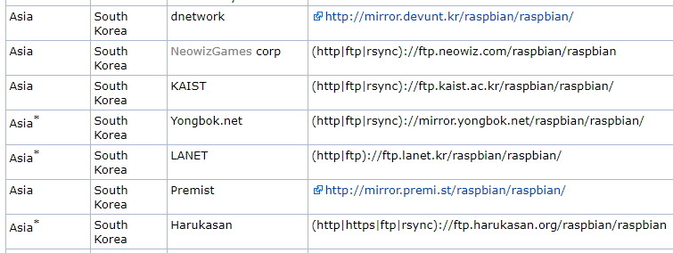

## 라즈베리파이 구성
  
- [라즈베리파이 3 B모델](https://www.raspberrypi.org/products/raspberry-pi-3-model-b/)  
- 마이크로SD카드(64GB)  
  
  
### 라즈비안 설치
- 소프트웨어 저장소(Repository) 변경 : [다른 저장소 확인](https://www.raspbian.org/RaspbianMirrors/)  
KAIST가 대체로 사용량이 많아 부경대(Harukasan)로 선택  

### 주피터 노트북 설치
- PIP 리파지터리 변경(미러 변경) - [참고](http://greenfishblog.tistory.com/255)  
(리눅스, 맥) $HOME/.pip/pip.conf / (윈도우) %appdata%\.pip\pip.ini  
~~~
[global]
index-url=http://ftp.daumkakao.com/pypi/simple
trusted-host=ftp.daumkakao.com
~~~
  
  
  
### [라즈베리파이 업데이트](./update.md)
-  
  
### [한글 사용](./hangul.md)  
- 
